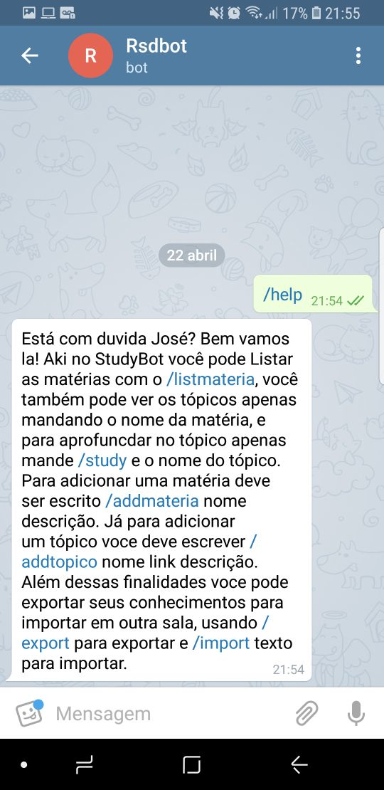

# Helperbot2.0
Este é o bot que irá mudar a forma de guardar suas informações!

### Inove a forma que você guarda suas informações!
>
> Agora com um bot no telegram todos podem organizar seus conhecimentos em tópicos e subtópicos!

---

### Sobre:
>
> Bot criado como resultado de um trabalho acadêmico desenvolvido na matéria de Engenharia de Software 3 para assimilação do uso do padrão de arquitetura de software MVC, proposto pelo professor Giuliano Bertoti em 2018, na instituição de ensino FATEC professor Jessen Vidal de São josé dos Campos.
> A funçao do bot é organizar conhecimentos de um usuário, ou de um grupo de usuários. As informações são divididas entre os usuários em grupos privados. Cada grupo possui suas informações que são divididas em tópicos e subtópicos, que podem ser consultados por usuários do grupo a qualquer momento.

---

### Tecnologias utilizadas
>
> Aplicativo de mensagens Telegram, linguagem de programação Java - utilizando padrão MVC, StarUML, Banco de Dados Não-Relacional MongoDB.

---

### Como utilizar
>
> O primeiro passo é iniciar o bot, enviando o comando _/start_. Se for a primeira vez que você está utilizando o bot este passo é necessário. É através do comando _/start_ que você efetua seu cadastro.
>
> 
>
> 
>
>
>
> #### *O seu guia*
>>
>> No Helper Bot o seu guia será o comando _/help_, que trará todas as informações necessárias para a utilização do bot.
>>
>> 
>  
>
>
>
> #### *Vamos começar a utilizar!*
>>
>> O bot organiza suas informaçes em tópicos, onde cada tópico pode possuir diversos subtópicos.
>> Para adicionar um tópico você deve enviar o nome do tópico pai, o nome do tópico, sua descrição, um link para acessar as informações do tópico e uma descrição. Aperte o botão _/addtopico_ e siga as instruções do bot.
>>
>> 
>> 
>> 
>
>
>
> #### *Agora vamos acessar nossas informações cadastradas*
>>
>> Parabéns! Agora você tem um tópico adicionado, pelo menos. Então vamos descobrir como ter acesso aos tópicos já cadastrados. Aperte o botão _/study_ para consultar o tópico que você quiser, desde que ele ja esteja cadastrado.
>>
>> 
>
>
>
> #### *E para ver os subtópicos de um tópico?*
>>
>> É simples. Para ver os subtópicos de um tópico pai você só precisa digitar o nome do tópico.
>>
>> 
>
> #### *Alterando um tópico ja cadastrado*
>>
>> Para alterar um tópico ja cadastrado aperte o botão _/alterartopico_ e siga as instruções do bot para alterar as informações desejadas.
>>
>> 
>
>
>
> ### *Deletando um tópico cadastrado*
>>
>> Se você deseja deletar um tópico, aperte o botão _/delete_ e siga as instruções do bot.
>>
>> 

